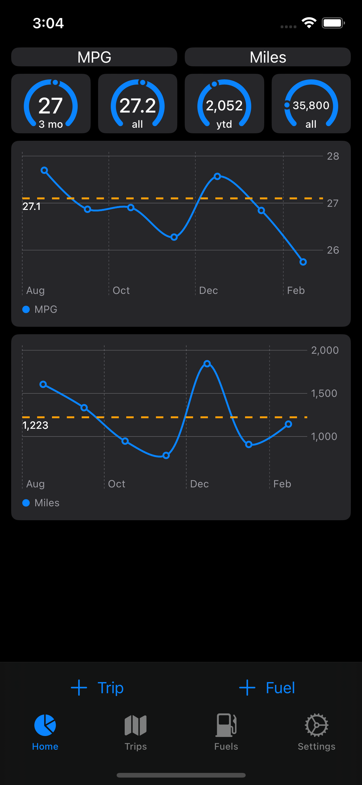

# Trips5
This is the latest iteration in what I think of as my learning app. It's a very simple vehicle tracking app, but it offers enough complexity to be useful as a way to learn new tools and techniques. For this iteration, my concentration was on SwiftUI, GRDB, and Async/Await. I also tried to utilize Actors to some degree although I'm not sure I really grok those yet.

## Vehicles
The demo data has a copy of my data for my current vehicle, so shortly after running the app a sync will pull that data into the app. If you want to add more vehicles, you can do so via Settings -> Vehicles. The Settings screen is also where you would switch vehicles, most of the app is disabled if there are no vehicles.

## Technical Details

### SwiftUI
I generally use a MVVM flavored architecture and I find that this works with SwiftUI pretty well. Previous iterations of this app started with Storyboards and then ultimately to UIKit in code which is what I used at work generally.

### GRDB
In my day job, we use FMDB, and I've used Core Data as the basis of previous iterations of this and other apps. For this iteration, I chose to use GRDB because the api is so much more swift-y feeling than Core Data. I've really enjoyed using it, there's a lot of flexibility from using raw SQL strings to using a builder-like api with the `Record` types.

### Sync
This app includes a fairly simple sync system that relies on timestamps. If you try hard enough I bet you can break it, but it works very well for my needs. I've used CloudKit before and found it to work pretty well, but the javascript cloudkit api is annoying to use to copy that data back to my personal database. This was the first chance I had to really use async/await, but I'm familiar with the general idea from javascript. I really enjoyed using it here.

### Combine
I found using Combine to be really nice for certain parts of the app, particularly the UI. I didn't end up using it for the data layer, but I did like how broadcasting the active vehicle to the rest of the app worked. I am familiar with the reactive style of programming with Combine and libraries in other languages, but I don't consider myself an expert here. Definitely curious to learn more.

### Testing
Flat out there aren't enough tests here, but I did add some. We mostly rely on unit tests in the day job, so the UI tests were fun to learn about here. Need to do more.